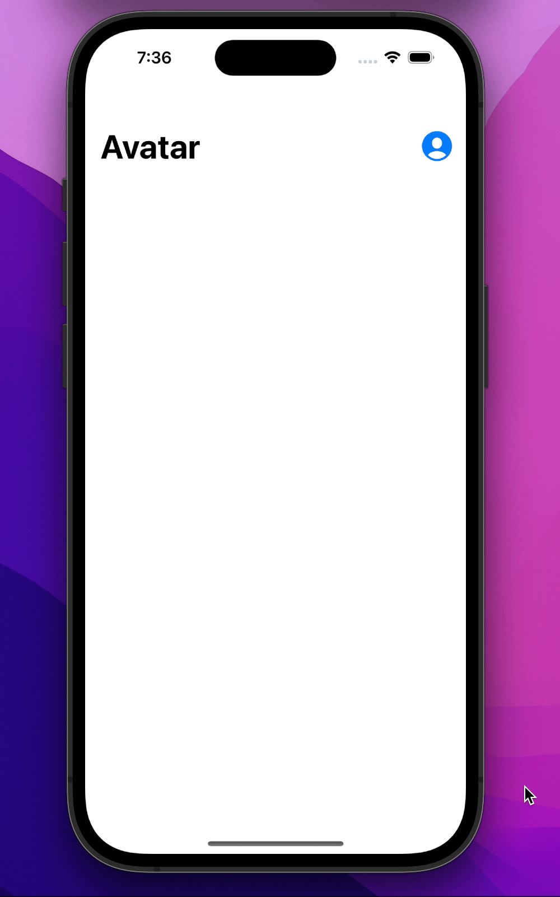
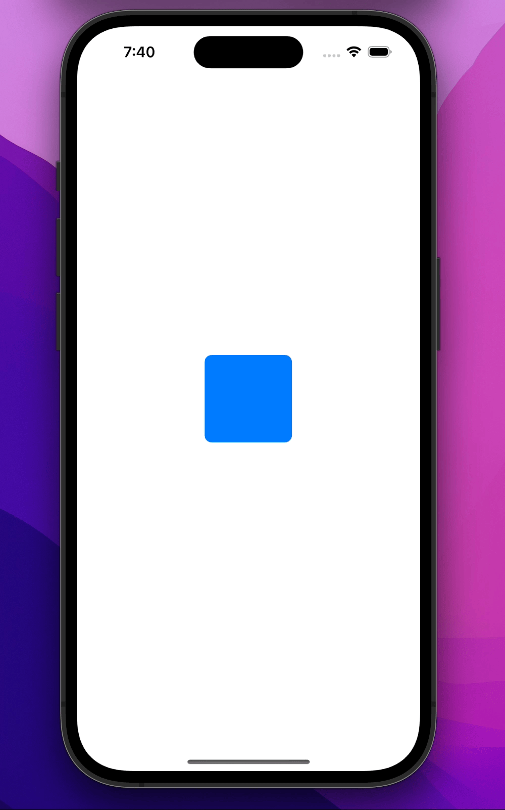
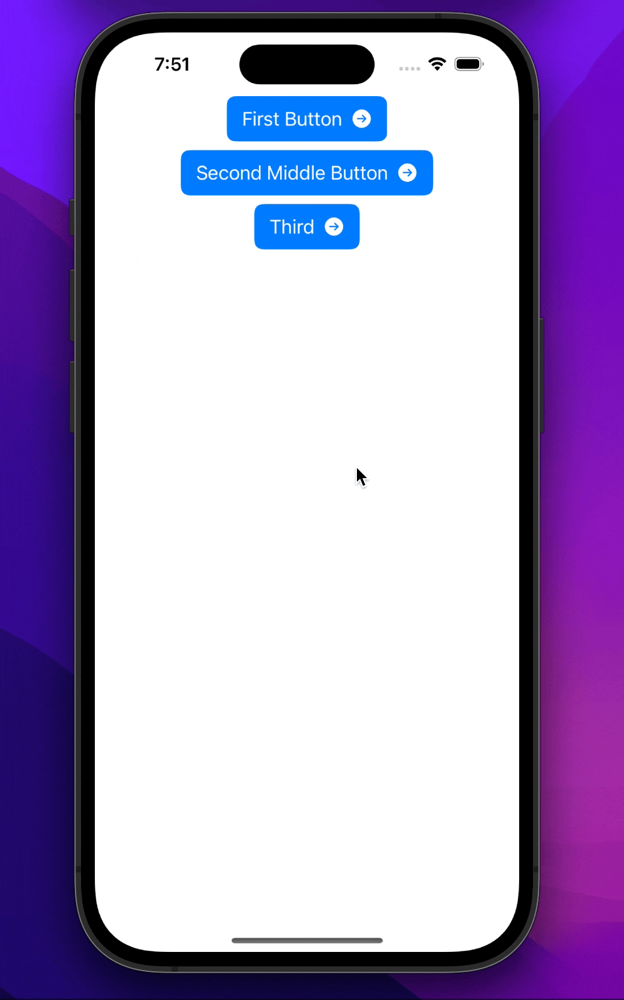

# UIKit-marathon

## Task 8

</img>
</img></img>

## Task 7

</img></img>

## Task 6

</img></img>

## Task 5

</img></img>

## Task 4

</img></img>

## Task 3

</img></img

## Task 2

</img></img>

## Task 1

</img></img>
                                                                                            
